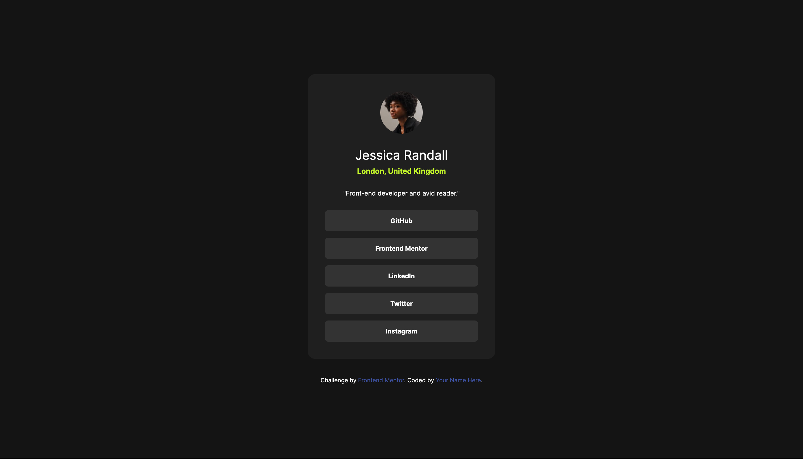

# Frontend Mentor - Social links profile solution

This is a solution to the [Social links profile challenge on Frontend Mentor](https://www.frontendmentor.io/challenges/social-links-profile-UG32l9m6dQ). Frontend Mentor challenges help you improve your coding skills by building realistic projects. 

## Table of contents

- [Overview](#overview)
  - [The challenge](#the-challenge)
  - [Screenshot](#screenshot)
  - [Links](#links)
- [My process](#my-process)
  - [Built with](#built-with)
  - [What I learned](#what-i-learned)
  - [Continued development](#continued-development)
  - [Useful resources](#useful-resources)
  - [AI Collaboration](#ai-collaboration)
- [Author](#author)

## Overview

### The challenge

Users should be able to:

- See hover and focus states for all interactive elements on the page

### Screenshot

### Links

- Solution URL: [GitHub Repository](https://github.com/cideval-dev/social-links-profile)
- Live Site URL: [GitHub Pages](https://cideval-dev.github.io/social-links-profile/)

## My process

### Built with

- Semantic HTML5 markup
- CSS custom properties
- Flexbox
- [Tailwind CSS](https://tailwindcss.com)

### What I learned

I learned to use Tailwind CSS, and I must say it was not easy at all at the first time... I don't know why but I struggled with bugs for approximately 4 hours. Tailwind was not making what it was expected to be made. Padding was not working, many arguments were not working... 

After a mental breakdown and a PTSD, I made the best decision to reset the project and install Tailwind CSS from zero. And then, everything worked! I was about to give up the project because it was outraging me. Now I love Tailwind lmao.

### Continued development

Later I think I will focus on SCSS or other modules like Tailwind CSS. I discovered another way of styling html and I love it. Maybe one day I will learn Nativewind, this could be really useful.

### Useful resources

- [Tailwind CSS documentation](https://tailwindcss.com/docs) - This documentation is really precious. This helped me along the development.

### AI Collaboration

I definitely hate AI for telling me not working solutions... I tried Gemini and Claude, but none of them knew how to save me from the catastrophic situation. They made things worse for me than anything else. After resetting the project I didn't need AI anymore.

## Author

- Website - [Vallérian Dicque](https://valleriandicque.myportfolio.com/projets-developpement)
- Frontend Mentor - [@cideval-dev](https://www.frontendmentor.io/profile/cideval-dev)
